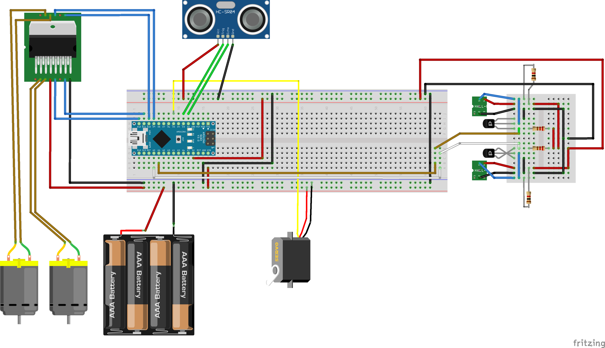

## The Room Rover

Autore: Lorenzo Romeo

Descrizione: The Room Rover è un piccolo veicolo in grado di mappare una stanza e successivamente di navigarla autonomamente.
Il suo funzionamento prevede due fasi principali: 
- La mappatura dell'ambiente: effettuata mediante un "radar" composto da un servo ed un sensore ultrasonico;
- L'esplorazione dell'ambiente: effettuata usando le informazioni ottenute nella fase di mappatura, accompagnata da eventuali rifiniture periodiche della mappa.

Hardware usato:
- 1x Arduino Nano
- 1x Servo (sm-s2309s) 
- 1x Ultrasonic sensor (hc-sr04)
- 1x Dual H-Bridge (L298N)
- 2x Hall sensor (3144) 
- 2x Motori DC
- 1x powebank (10 000 mAh)
- 2x resistors (220 ohm)
- 2x resistors (1k ohm)
- 2x transistors (bc 547b)

Link a repo: https://github.com/LorenzoRomeo0/The-Room-Rover

Licenza scelta: GPLv3 (https://www.gnu.org/licenses/licenses.html)

Data stimata di presentazione: Febbraio 2023

### Circuito 
